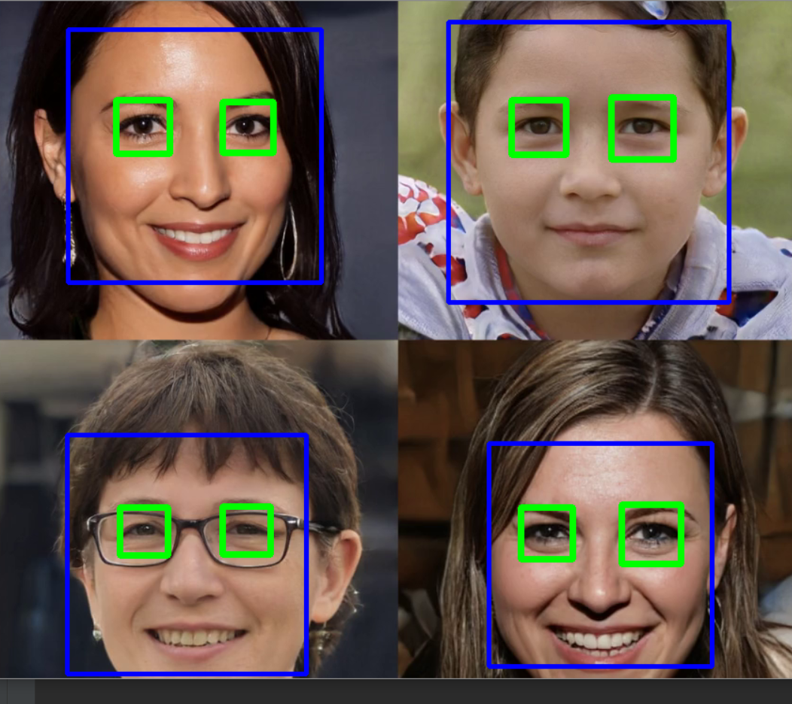
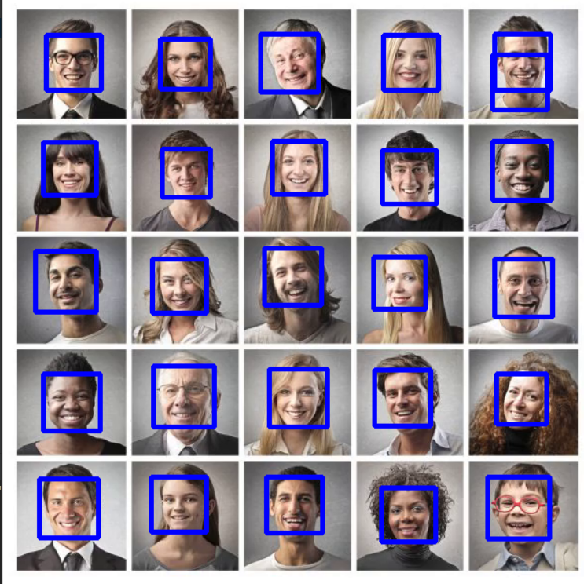

# Automatic-Attedance
Program to capture online attendance through web-cam.

In this Code we are going to learn how to perform Facial recognition with high accuracy. We will first briefly go through the theory and learn the basic implementation. Then we will create an Attendance project that will use webcam to detect faces and record the attendance live in an excel sheet.

# First Add Following Dependencies..
1. cmake
2. dlib
3. face-recognition
4. numpy
5. opencv-python

After installing these dependencies to your IDE or syetem ( if you are using Anaconda command line ).

Now create two folders one for Basics.py two check the encoding working fine or not and another one is for attendanceproject.py
to create a database set of images over their and to retrive those to match with live web-cam.

After doing all these step simply put your images which you wants to be in the database and run the code.

## Here are some Output check them all: -

Picture 1     
   

Picture 2

CSV File 

